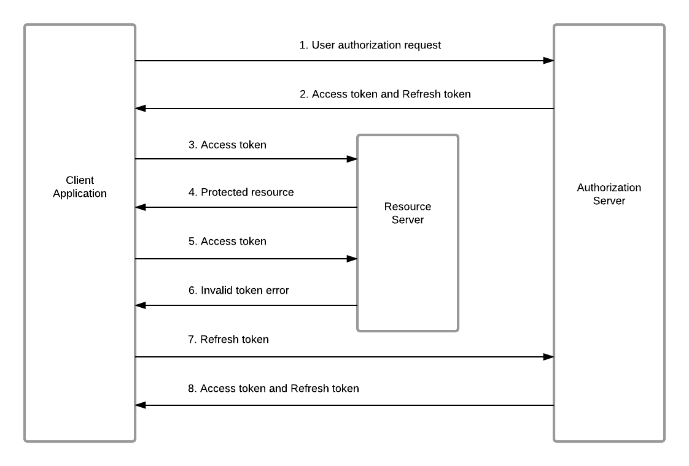

# Auth Service

#### Powered by

## About & Features
Tiny authorization service using JWT pairs (access & refresh), suitable for bootstrapping small projects.  
Refresh token is on rotation for better simplicity (rather than token invalidation mechanism).  
Maintains a single DB collection: `users`.  
Includes example cURL commands for easy testing in your own environment.  

## Reference
</img>

## Prerequisites
- [Node.js](https://nodejs.org/en/download)
- [MongoDB](https://www.mongodb.com/try/download/community)

## Legal
Copyright (C) 2025  Yuval .R.

This program is free software: you can redistribute it and/or modify it under the terms of the GNU General Public License as published by the Free Software Foundation, either version 3 of the License, or (at your option) any later version.

This program is distributed in the hope that it will be useful, but WITHOUT ANY WARRANTY; without even the implied warranty of MERCHANTABILITY or FITNESS FOR A PARTICULAR PURPOSE. See the GNU General Public License for more details.

You should have received a copy of the GNU General Public License along with this program. If not, see <http://www.gnu.org/licenses/>.
